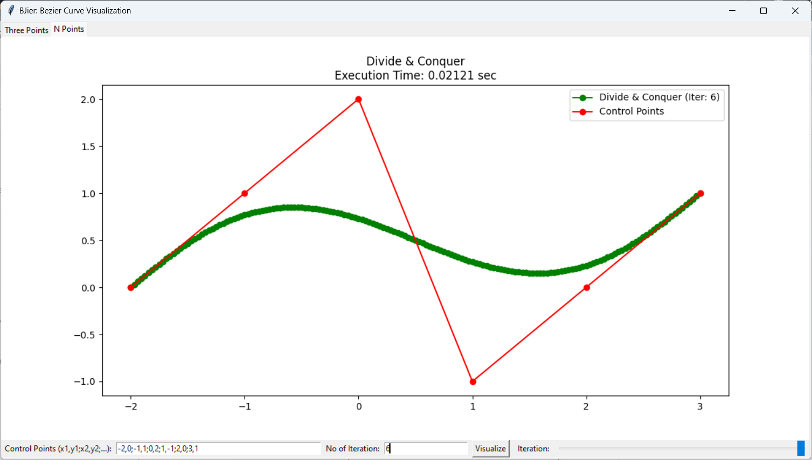

# Tucil2_13522126
> This project aims to visualize quadratic bézier curves using two different algorithms: brute force and divide and conquer.

## Table of Contents
* [General Info](#general-information)
* [Technologies Used](#technologies-used)
* [Features](#features)
* [Screenshots](#screenshots)
* [Setup](#setup)
* [Usage](#usage)
* [Project Status](#project-status)
* [How to Use](#how-to-use)
* [Contact](#contact)
<!-- * [License](#license) -->

## General Information
This project visualizes quadratic bézier curves using two different algorithms: brute force and divide and conquer. The purpose is to compare the execution time and understand the complexity of these algorithms in generating quadratic bézier curves.
<!-- You don't have to answer all the questions - just the ones relevant to your project. -->

## Technologies Used
- Python
- Tkinter
- Matplotlib
- NumPy

## Features
- Visualization of quadratic bézier curves
- Visualization of multi-points bézier curves
- Comparison of execution time between brute force and divide and conquer algorithms

## Screenshots

<!-- If you have screenshots you'd like to share, include them here. -->

### Program Execution
    git clone https://github.com/rizqikapratamaa/Tucil2_13522126
    cd Tucil1_13522126
    pip install -r requirements.txt
    cd src
    python main.py

## Project Status
Project is complete

## How to Use
Upon running main.py, the application window will appear with two tabs: "Three Points" and "N Points". In the "Three Points" tab, you can input the coordinates of three control points and adjust the number of iterations using the slider to visualize the quadratic Bezier curve. In the "N Points" tab, you can input multiple control points separated by semicolons and adjust the number of iterations to visualize the Bezier curve.

## Contact
Created by [@rizqikapratamaa](https://www.instagram.com/rizqikapratamaa) - feel free to contact me!

<!-- Optional -->
<!-- ## License -->
<!-- This project is open source and available under the [... License](). -->

<!-- You don't have to include all sections - just the one's relevant to your project -->